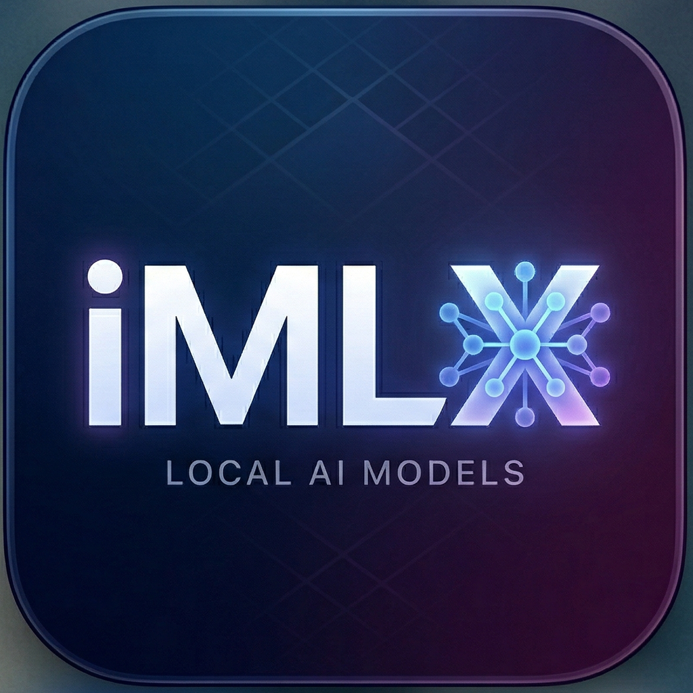

# iMLX



On-device AI chat for iOS and iPadOS using MLX Swift.

Status: Functional and actively evolving.

iMLX runs supported LLMs locally on Apple Silicon with no cloud dependency.

## Features

- Fully on-device inference with MLX
- Streaming token output in chat UI
- Model browser and download management
- Conversation persistence and history (chat-first launch; open history from the chat toolbar)
- Device-aware model recommendations
- Per-model thinking mode (toggle + chat-template `enable_thinking` where supported)
- Branded launch/loading experience with the iMLX logo
- Per-message generation metrics shown inline in assistant responses
- Load and unload downloaded models directly from Chat and Models screens

## Recent Updates

- Chat tab opens straight into the current conversation on iPhone and iPad; use the top-left list button to browse or switch chats.
- Startup now validates downloaded model manifests against on-disk files and prunes stale entries.
- Model path resolution is more resilient (symlink + cache snapshot fallback) and auto-heals broken links.
- Simulator model loading/generation now returns a clear unsupported message instead of entering an MLX load path.
- Chat keeps context visible during model loading and shows a compact loading/status card.
- Settings now use plain-language response style controls (Creativity, Focus, Repetition Control).
- Generation now applies internal safety caps for long responses, especially when thinking is enabled, stops early under severe memory pressure to reduce iOS jetsam risk, gives compact models a larger thinking budget than 4B-class models, detects repetitive hidden-thinking loops, and automatically performs a short answer-only follow-up if a thinking run ends without a visible final response.

## Requirements

- macOS with Xcode 16+
- iOS 18.0+ deployment target
- Apple Silicon device for best performance
- Metal Toolchain installed for CLI builds

## Quick Start

### 1) Resolve Swift packages

```bash
xcodebuild -resolvePackageDependencies \
  -project "iMLX.xcodeproj" \
  -scheme "iMLX"
```

### 2) Install Metal Toolchain

```bash
xcodebuild -downloadComponent MetalToolchain
```

### 3) Build for iOS Simulator

```bash
xcodebuild build \
  -project "iMLX.xcodeproj" \
  -scheme "iMLX" \
  -destination 'platform=iOS Simulator,name=iPhone 17 Pro' \
  CODE_SIGN_IDENTITY="-" CODE_SIGNING_REQUIRED=NO
```

### 4) Build for physical device

```bash
xcodebuild build \
  -project "iMLX.xcodeproj" \
  -scheme "iMLX" \
  -destination 'generic/platform=iOS'
```

## Project Structure

```text
iMLX/
├── App/
├── Models/
├── Services/
├── Utilities/
├── ViewModels/
└── Views/
```

## Technical Notes

- MLX array operations are serialized through an actor-based inference service.
- Simulator builds may run on CPU fallback and are not representative of real-device performance.
- Inference is intended for foreground app usage.

## License

This project is dual-licensed under either of the following, at your option:

- Apache License 2.0 ([LICENSE-APACHE](LICENSE-APACHE))
- MIT License ([LICENSE-MIT](LICENSE-MIT))

Copyright (c) 2026 Alan Beltran Pozo
