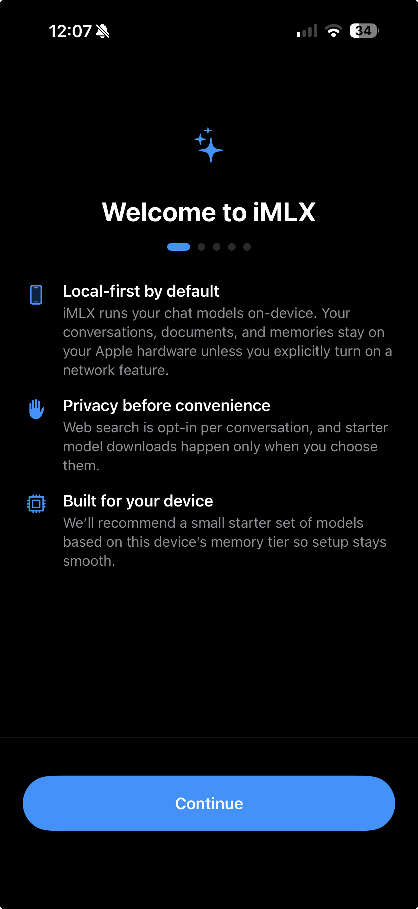
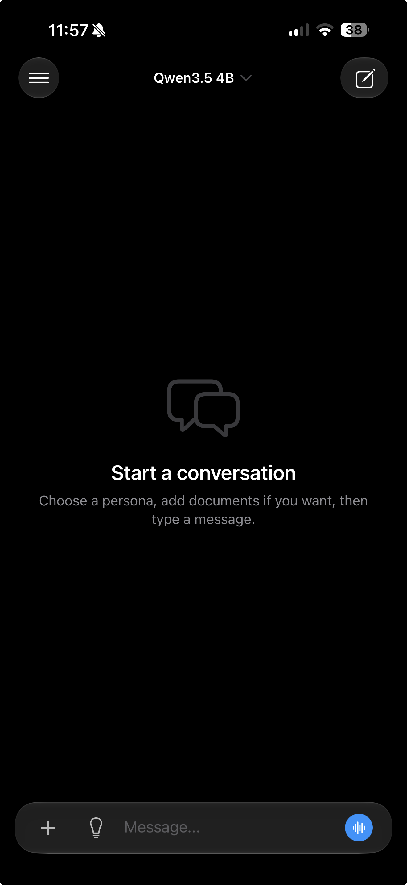
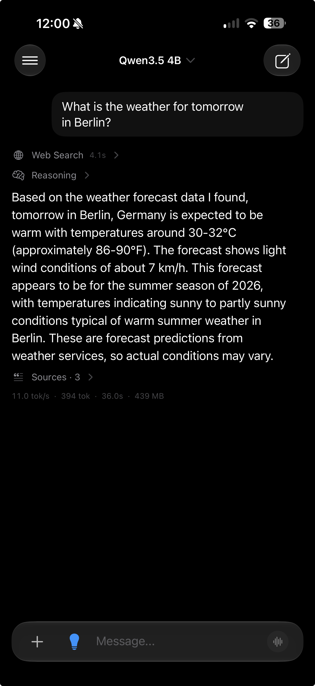
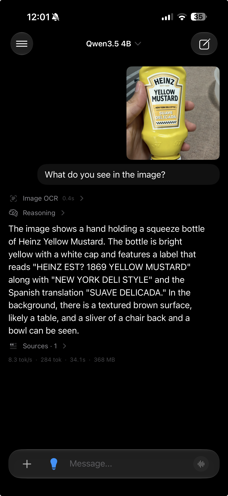
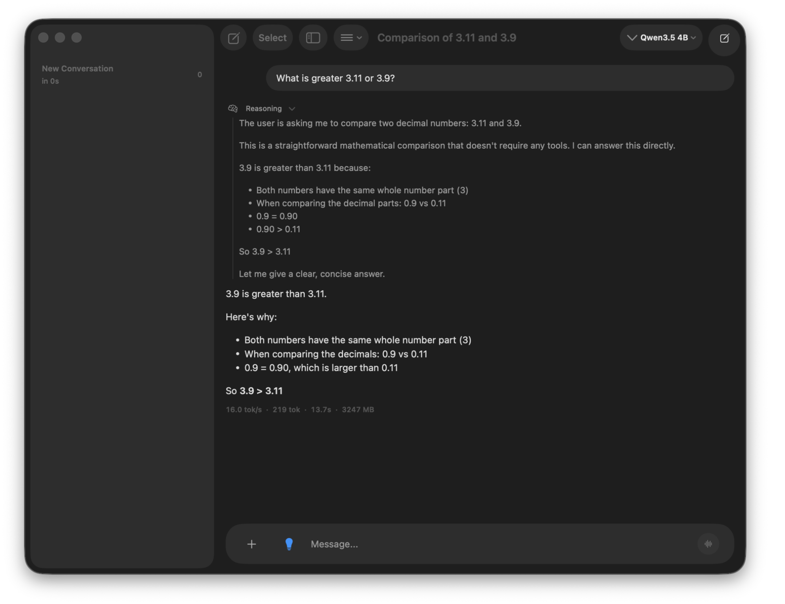
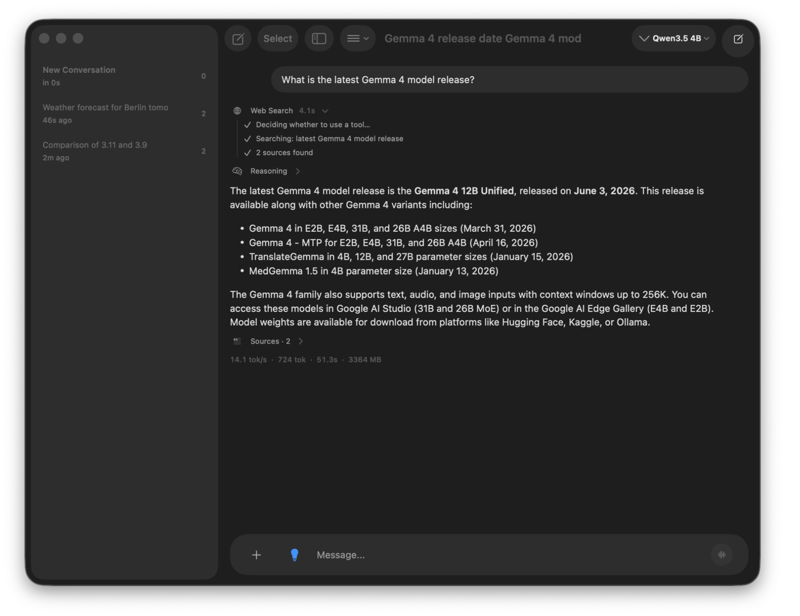

<p align="center">
  
</p>

<h1 align="center">iMLX</h1>

<p align="center"><strong>Local-first AI chat for iPhone, iPad, and native Mac.</strong></p>
<p align="center">One repository · Two native apps · One shared MLX inference stack</p>

<p align="center">
  iOS 26+ · iPadOS 26+ · macOS 26+ · Apple silicon · SwiftUI · MLX Swift
</p>

---

## What is iMLX?

iMLX is an open-source SwiftUI application for downloading and running supported language and vision-language models directly on Apple hardware. It provides streaming chat, conversation history, local memory, document grounding, image understanding, voice conversations, model management, profiling, and an optional tool system without requiring an iMLX account or a developer-operated inference server.

The repository produces two real applications:

- **`iMLX`** — the iOS/iPadOS app, built around mobile navigation, camera and photo input, background model downloads, AlarmKit timers, and a timer Live Activity.
- **`iMLXMac`** — a native Apple-silicon macOS app, not a “Designed for iPad” wrapper. It uses a desktop `NavigationSplitView`, Mac commands and Settings scenes, drag and drop, security-scoped model folders, and desktop-specific memory policies.

Most product behavior is shared. Prompt construction, model loading, token streaming, conversations, memory, documents, tool routing, model management, and the majority of the SwiftUI interface live under `iMLX/Shared`. Thin target-selected adapters under `iMLX/Platforms` own the parts that genuinely differ between UIKit/AlarmKit and AppKit/macOS.

> **Project status:** iMLX is under active development. The model catalog, persistence formats, and platform behavior may evolve. Models and speech assets are third-party downloads with their own licenses and hardware requirements.

---

## Screenshots

### iOS

<p align="center">
  
  
  
  
</p>

<p align="center"><sub>Privacy-first onboarding · Local chat · Grounded web search · Image OCR</sub></p>

### Native macOS

<p align="center">
  
  
</p>

<p align="center"><sub>Local reasoning · Tool use and source-grounded answers</sub></p>

---

## iOS and macOS at a glance

| Capability | iOS / iPadOS | Native macOS |
|---|:---:|:---:|
| Local text and vision-model inference | Yes, on a physical device | Yes, on Apple silicon |
| Curated Hugging Face model downloads | Yes | Yes |
| External folder of existing MLX models | — | Yes, using a security-scoped bookmark |
| Conversation and memory persistence | Local app container | Local sandbox container |
| Images and documents | Camera, Photos, Files | File picker and drag and drop |
| Live Voice | Yes | Yes |
| Calendar, Reminders, Contacts, documents, OCR, web tools | Yes | Yes |
| Native timer tool | AlarmKit + Live Activity | Not exposed |
| Tool calls allowed per assistant turn | Up to 1 | Up to 2 sequential calls |
| Navigation | `NavigationStack` | `NavigationSplitView` |
| Settings | In-app settings navigation | Native macOS Settings scene |
| App commands | Mobile actions and App Shortcuts | Native menu commands and shortcuts |

The two apps intentionally share saved-data formats and core behavior while keeping OS-only frameworks out of shared source.

---

## Core capabilities

### Local model inference

- Loads MLX text models through the LLM path and vision-capable models through the VLM path.
- Streams generated text into the transcript as it is produced.
- Rebuilds every prompt from the visible conversation instead of relying on hidden, long-lived chat state.
- Supports model-specific thinking controls where the model metadata allows them.
- Applies device-aware prefill, KV-cache, quantization, and memory policies.
- Serializes all MLX model and array work through the `InferenceService` actor.
- Records optional generation and memory profiles, benchmarks, crash-recovery metadata, and IFBench results.

The curated catalog currently covers compact and larger variants from families such as Qwen, Qwen-VL, MiniCPM, Gemma, Mistral/Ministral, LFM, and Bonsai. The exact catalog and repository identifiers are maintained in [`Constants.swift`](iMLX/Shared/Utilities/Constants.swift), which is the source of truth.

### Model management

- Browses curated models with size and estimated-memory metadata.
- Downloads model repositories from Hugging Face with progress, cancellation, restoration, and manifest persistence.
- Supports background URL-session download callbacks.
- Restores downloaded-model state across launches.
- On macOS, discovers existing MLX model directories from a user-selected folder. A model directory must contain `config.json` and at least one `.safetensors` file; vision models also require processor or preprocessor configuration.

Downloaded model files are not part of the iMLX license. Review each model card and license before use or redistribution.

### Chat and rendering

- Streaming, multi-turn conversations with durable local history.
- Per-conversation model selection and Web Search state.
- Markdown, code, lists, tables, links, inline math, and display math.
- Separate presentation for model reasoning and final answers when the model emits supported reasoning markers.
- Generation statistics including token counts, throughput, duration, and memory measurements when available.
- Global assistant settings for the system prompt and temperature.

### Images, OCR, and documents

- Sends attached images to compatible vision-language models.
- Extracts visible text locally with Apple Vision through the `ocr_image_text` tool.
- Imports **PDF, CSV, plain-text, and Markdown** documents.
- Extracts, chunks, indexes, and ranks document text locally.
- Injects bounded excerpts rather than entire unbounded documents.
- Preserves source labels and locations so grounded answers can identify their evidence.

OCR and URL-reading context are deliberately limited to the latest user turn. The app does not silently reuse old images or scrape URLs from earlier messages.

### Local memory

The memory system is an optional, local personalization layer backed by GRDB/SQLite:

- Saves only facts grounded in user-provided text.
- Stores source quotes and lifecycle events with each canonical memory.
- Uses typed fact relations for duplicate and contradiction handling.
- Supports pending review, acceptance, rejection, editing, archiving, forgetting, and deletion.
- Retrieves a bounded set using FTS, fact lookup, local semantic reranking, salience, and recency.
- Records explanations for why a memory was retrieved.
- Can use the active local model or Apple Foundation Models, when available, for extraction; retrieval itself remains local and synchronous.

Assistant answers, generated recommendations, and unsupported inferences are not valid memory evidence. See [`docs/memory-architecture.md`](docs/memory-architecture.md) for the data model and retrieval pipeline.

### Voice

- Requires on-device speech recognition through Apple’s Speech framework.
- Supports English, Spanish, and Simplified Chinese voice locales.
- Downloads Kokoro model and voice assets only when requested.
- Synthesizes and streams speech locally through the vendored MLX Kokoro implementation.
- Coordinates model unloading and restoration on memory-constrained devices.
- Automatically returns to listening after spoken playback while guarding against stale recognition callbacks.

### Tools and grounded actions

The tool layer combines deterministic routing for clear requests with local-model planning for eligible ambiguous requests. Planner output is treated as untrusted and is normalized and validated before execution.

| Tool | Purpose | Availability |
|---|---|---|
| `current_datetime` | Device-local date, time, weekday, and timezone | Both apps |
| `document_synthesize` | Bounded retrieval and synthesis over attached documents | Both apps |
| `ocr_image_text` | Local OCR over images on the latest user message | Both apps |
| `web_search` | DuckDuckGo search plus bounded, source-attributed excerpts | Both apps, Web Search must be enabled |
| `read_url` | Reads one public HTTP/HTTPS URL from the latest user message | Both apps, Web Search must be enabled |
| `calendar_brief` / `calendar_create` | Read a bounded calendar range or create one explicit event | Both apps, system permission required |
| `reminders_brief` / `reminders_create` | Read incomplete reminders or create one explicit reminder | Both apps, system permission required |
| `contacts_lookup` | Find matching names, phone numbers, and email addresses | Both apps, system permission required |
| `timer_create` | Start a 1-second to 24-hour native timer | iOS/iPadOS only |

Safety rules are enforced in code:

- Enabling Web Search makes network tools available; it does not force every message online.
- `read_url` accepts exactly one public URL from the latest user turn.
- A turn can perform at most one explicitly requested mutation.
- A mutation ends the tool loop.
- Invalid or ambiguous planner output fails closed to normal model generation.
- Retrieval context is clipped and source-attributed before prompt injection.

---

## Privacy and network behavior

### What stays local

By default, iMLX keeps the following in the app’s local container or sandbox:

- Conversations and attachments
- Imported documents and indexes
- Memories, source evidence, and retrieval events
- Downloaded models and speech assets
- App preferences
- Optional inference profiles and benchmark results

Core inference, prompt construction, OCR, memory retrieval, document retrieval, and Kokoro synthesis run on device. The project contains no advertising SDK, analytics SDK, or developer-operated iMLX backend.

### What can use the network

| Feature | Recipient | Information sent |
|---|---|---|
| Model and speech downloads | Hugging Face | Requested repository/file path and normal network metadata |
| Web Search | DuckDuckGo and selected result sites | Search query and normal web-request metadata |
| Read URL | Host specified by the user | Requested URL and normal web-request metadata |
| Package resolution during development | Repositories in `Package.resolved` | Normal package/source-control request metadata |

Web Search is off by default for a conversation and requires disclosure before first use. Calendar, Reminders, Contacts, camera, Photos, files, microphone, speech recognition, and AlarmKit are gated by Apple system permissions. Data managed by Apple frameworks may separately sync according to the user’s configured accounts; iMLX does not operate that synchronization.

Read the full behavior summary in [`docs/privacy.md`](docs/privacy.md).

---

## Requirements

### To build

- An Apple-silicon Mac
- macOS with **Xcode 26 or newer**
- The Xcode **Metal Toolchain**
- Internet access for the initial Swift package resolution

### To run

- **iOS/iPadOS 26 or newer** on a physical Apple device, or
- **macOS 26 or newer** on an Apple-silicon Mac
- Enough free storage and memory for the selected model
- Internet access for initial model downloads and optional network tools

After a model and any requested speech assets are downloaded, ordinary local chat does not require an internet connection.

> The iOS Simulator is for UI, build, and unit-test verification only. It cannot run MLX inference, AlarmKit scheduling, or Live Activities.

---

## Build from source

### 1. Clone and resolve packages

```bash
git clone https://github.com/alan13367/iMLX.git
cd iMLX

xcodebuild -resolvePackageDependencies \
  -project "iMLX.xcodeproj" \
  -scheme "iMLX"
```

The resolved graph is recorded in `iMLX.xcodeproj/project.xcworkspace/xcshareddata/swiftpm/Package.resolved`. Major dependencies include MLX Swift, MLX Swift LM, GRDB, Textual, ZIPFoundation, `swift-tokenizers`, and `swift-tokenizers-mlx`.

### 2. Install the Metal Toolchain

```bash
xcodebuild -downloadComponent MetalToolchain
```

SwiftPM CLI alone cannot compile the MLX Metal components; use Xcode or `xcodebuild`.

### 3. Build iOS/iPadOS for Simulator

```bash
xcodebuild build \
  -project "iMLX.xcodeproj" \
  -scheme "iMLX" \
  -destination 'platform=iOS Simulator,name=iPhone 17 Pro' \
  CODE_SIGN_IDENTITY="-" CODE_SIGNING_REQUIRED=NO
```

### 4. Build native macOS

```bash
xcodebuild build \
  -project "iMLX.xcodeproj" \
  -scheme "iMLXMac" \
  -destination 'platform=macOS,arch=arm64' \
  CODE_SIGNING_ALLOWED=NO
```

### 5. Build for a physical iPhone or iPad

Select your Apple development team in Xcode and give forks unique app and widget bundle identifiers if necessary, then build:

```bash
xcodebuild build \
  -project "iMLX.xcodeproj" \
  -scheme "iMLX" \
  -destination 'generic/platform=iOS'
```

If the active developer directory points to Command Line Tools rather than Xcode, prefix commands with the appropriate `DEVELOPER_DIR`, for example:

```bash
DEVELOPER_DIR=/Applications/Xcode.app/Contents/Developer xcodebuild …
```

---

## Tests

### iOS Simulator tests

```bash
xcodebuild test \
  -project "iMLX.xcodeproj" \
  -scheme "iMLX" \
  -destination 'platform=iOS Simulator,name=iPhone 17 Pro' \
  -only-testing:iMLXTests \
  CODE_SIGN_IDENTITY="-" CODE_SIGNING_REQUIRED=NO
```

### Native macOS tests

```bash
xcodebuild test \
  -project "iMLX.xcodeproj" \
  -scheme "iMLXMac" \
  -destination 'platform=macOS,arch=arm64' \
  -only-testing:iMLXMacTests \
  CODE_SIGNING_ALLOWED=NO
```

Shared tests run against both application targets. Platform-boundary tests run only against their matching target.

---

## Repository architecture

```text
iMLX/
├── Shared/                    # Compiled into iOS/iPadOS and macOS
│   ├── App/                   # Shared routes and lifecycle composition
│   ├── Models/                # Domain and backward-compatible persisted models
│   ├── Resources/             # Asset catalog and localization
│   ├── Services/              # Inference, memory, tools, documents, web, persistence
│   ├── Utilities/             # Cross-platform policy and helpers
│   ├── ViewModels/            # Chat, voice, and model orchestration
│   └── Views/                 # Shared SwiftUI product interface
├── Platforms/
│   ├── iOS/                   # iOS app shell, UIKit, AlarmKit, mobile adapters
│   └── macOS/                 # Mac app shell, AppKit, commands, desktop adapters
└── Vendor/                    # Vendored Kokoro, Misaki, and MLX utilities

iMLXTests/
├── Shared/                    # Runs against both app targets
└── Platforms/
    ├── iOS/
    └── macOS/

iMLXAlarmWidget/              # iOS timer Live Activity extension
iMLX.xcodeproj/               # App, widget, and test targets
```

### Dependency direction

```text
Platforms/iOS  ─┐
                ├──> Shared ──> Vendor / Swift package products
Platforms/macOS ┘
```

The Xcode project uses synchronized source roots to enforce target membership:

- Shared code cannot import UIKit, AppKit, or AlarmKit.
- Shared code does not choose between iOS and macOS with broad `#if os(...)` branches.
- Each platform compiles only its own adapters and app entry point.
- The Alarm widget receives only its narrow shared timer metadata exception.

See [`docs/cross-platform-source-boundaries.md`](docs/cross-platform-source-boundaries.md) for the target matrix and extension rules.

### Key service boundaries

- **`AppState`** owns shared services, selected models, conversations, memories, and persisted app preferences.
- **`ChatViewModel`** owns the transcript, attachments, sending, streaming UI state, tool traces, and conversation updates.
- **`InferenceService`** is the serialized boundary for every MLX model and array operation.
- **`ModelDownloadService`** owns repository metadata, manifests, background jobs, and download restoration.
- **`MemorySystem` / `MemoryStore`** own extraction policy, local retrieval, and actor-backed GRDB persistence.
- **`ToolCallingService`** exposes tool planning and execution while dedicated router, validator, parser, and executor files own policy.
- **`DocumentLibraryService`** and **`WebSearchService`** remain separate because their transport, persistence, and retrieval policies differ.

---

## Runtime constraints and known limitations

- **Foreground inference only:** iOS and macOS do not provide a supported background-GPU execution model for this app.
- **Memory is the primary limit:** large models, long prompts, vision inputs, and excessive retrieval context can terminate an app under pressure.
- **Simulator limitations:** no MLX inference, AlarmKit, or Live Activities.
- **Native Mac requirement:** the `iMLXMac` target supports Apple silicon only.
- **Timer difference:** `timer_create` is intentionally absent on macOS because there is no implemented native Mac scheduler.
- **Model compatibility:** a repository being in MLX format does not guarantee that its architecture, tokenizer, chat template, or quantization is supported.
- **Vision loading:** vision-capable checkpoints must include the processor configuration required by the VLM path.
- **Network grounding:** websites may block automated reading, return incomplete content, or change structure; the app surfaces bounded excerpts rather than claiming full-page access.
- **Generated output:** local models can still be inaccurate. Source panels show retrieval provenance, not a guarantee that every generated statement is correct.

---

## Localization

The UI follows the system-selected app language. Current localized resources cover:

- English
- Spanish
- Simplified Chinese

Live Voice resolves those system locales to English, Spanish, or Simplified Chinese recognition and Kokoro voices.

---

## Contributing and support

Contributions are welcome. Before a substantial change:

1. Read [`CONTRIBUTING.md`](CONTRIBUTING.md).
2. Follow the [`CODE_OF_CONDUCT.md`](CODE_OF_CONDUCT.md).
3. Preserve the source boundaries documented above.
4. Run the relevant local iOS and macOS builds and tests.

- General help and bug reports: [`SUPPORT.md`](SUPPORT.md)
- Private vulnerability reports: [`SECURITY.md`](SECURITY.md)
- Vendored-code provenance: [`docs/vendor-code.md`](docs/vendor-code.md)

This repository intentionally does not include hosted CI workflows.

---

## License and third-party software

Original iMLX code is available under either license, at your option:

- [Apache License 2.0](LICENSE-APACHE)
- [MIT License](LICENSE-MIT)

Vendored code, Swift package dependencies, downloaded models, voice assets, and third-party logos remain governed by their respective terms. See:

- [`NOTICE`](NOTICE)
- [`THIRD_PARTY_NOTICES.md`](THIRD_PARTY_NOTICES.md)
- [`ThirdPartyLicenses/`](ThirdPartyLicenses)
- [`TRADEMARKS.md`](TRADEMARKS.md)

Copyright © 2026 Alan Beltran Pozo
